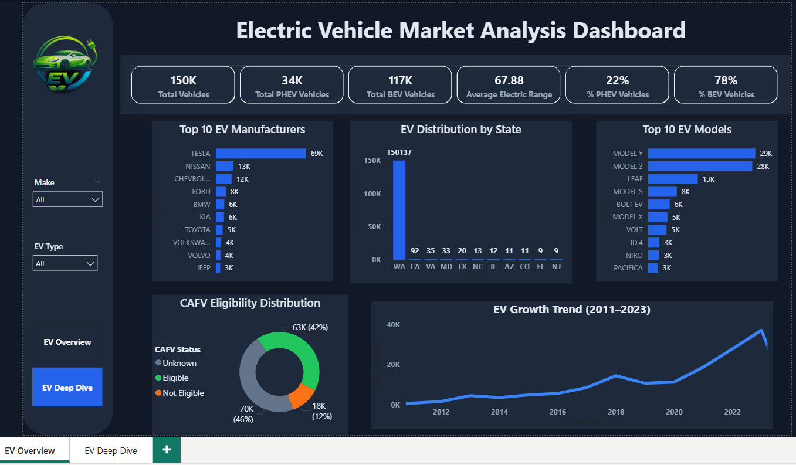
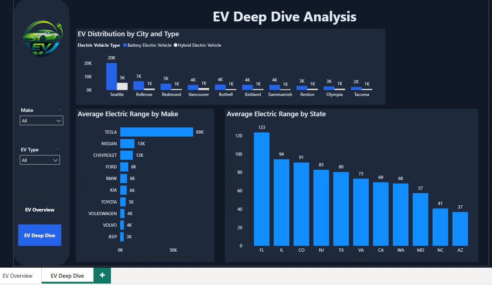

# 🚗 Electric Vehicle Market Analysis Dashboard | Power BI

An end-to-end Power BI dashboard analyzing Electric Vehicle (EV) adoption trends, manufacturer performance, geographic distribution, and CAFV eligibility insights.

This project demonstrates data modeling, DAX calculations, dashboard design principles, and business storytelling using Power BI.

---

## 📸 Dashboard Preview

### 🔹 EV Overview Page

---

### 🔹 EV Deep Dive Page

---

## 📊 Project Overview

This interactive dashboard provides a comprehensive analysis of the Electric Vehicle market using real-world data.

It focuses on:

- EV adoption growth trends (2011–2023)
- Top EV manufacturers and models
- Geographic distribution by state and city
- Battery Electric vs Hybrid comparison
- Average electric range analysis
- CAFV (Clean Alternative Fuel Vehicle) eligibility distribution

---

## 📌 Key Business Insights

- Significant EV adoption growth in recent years.
- Battery Electric Vehicles dominate Hybrid Vehicles in major cities.
- Certain states show higher average electric range adoption.
- Tesla leads in overall vehicle count among manufacturers.
- Geographic concentration highlights market expansion opportunities.

---

## 🛠 Tools & Technologies Used

- **Power BI Desktop**
- **DAX (Data Analysis Expressions)**
- **Excel (Data Cleaning & Preparation)**
- **GitHub (Version Control & Documentation)**

---

## 📁 Repository Contents

| File Name | Description |
|-----------|-------------|
| `Electric_vehicle_market_analysis.pbit` | Power BI dashboard template file |
| `Electric_Vehicle_Population_Data.xlsm` | Dataset used for analysis |
| `EV_overview_image.png` | Overview dashboard preview |
| `EV_deep_dive_image.png` | Deep Dive dashboard preview |
| `README.md` | Project documentation |

---

## 🎯 Dashboard Features

- Multi-page navigation (Overview & Deep Dive)
- Executive KPI cards
- Top N filtering visuals
- Dynamic slicers (Make & EV Type)
- Interactive drill-down capability
- Clean dark-themed UI for professional presentation

---

## 🧠 Skills Demonstrated

- Data Modeling
- DAX Measure Creation
- Data Visualization Best Practices
- Business Insight Extraction
- UI/UX Dashboard Design
- GitHub Project Documentation

---

## 👤 Author

**Sumit Ghodke**  
Aspiring Data Scientist | AI Engineer | Data Analytics Enthusiast  

🔗 LinkedIn:  
https://www.linkedin.com/in/sumit-ghodke-a45a82205/

---

## ⭐ If You Found This Project Useful

Feel free to star ⭐ the repository and connect with me on LinkedIn!
